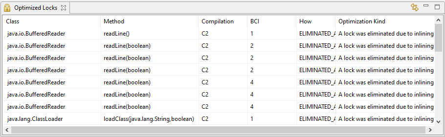

# JITWatch eclipse integration

## Get it

- [Eclipse Marketplace](https://marketplace.eclipse.org/content/jitclipse/index.html)
- [Update Site](update-site/1.0.1)

Drag the install button to your running Eclipse* workspace (*Requires Eclipse Marketplace Client):

 

## Screenshots

´